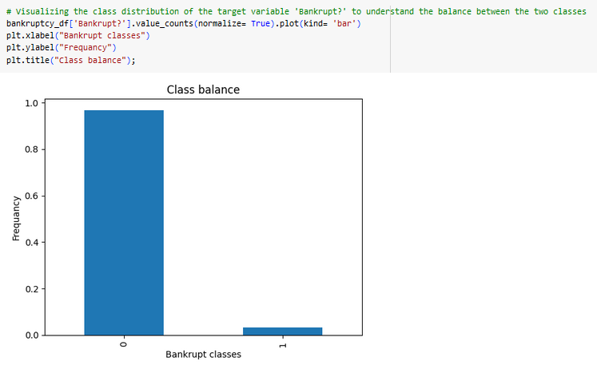
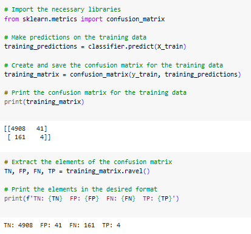
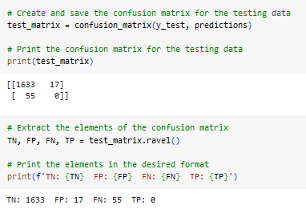
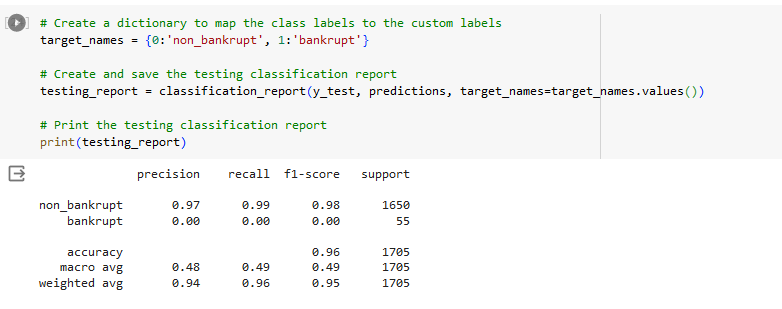
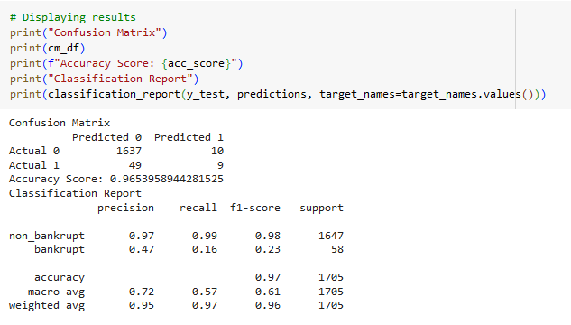
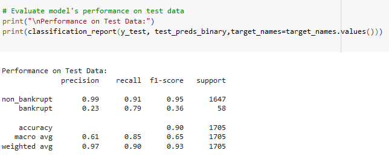
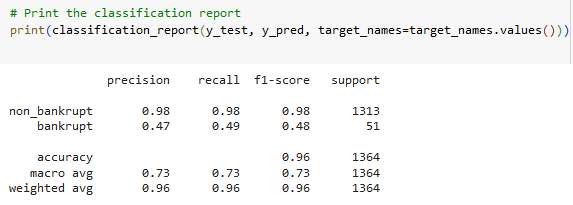
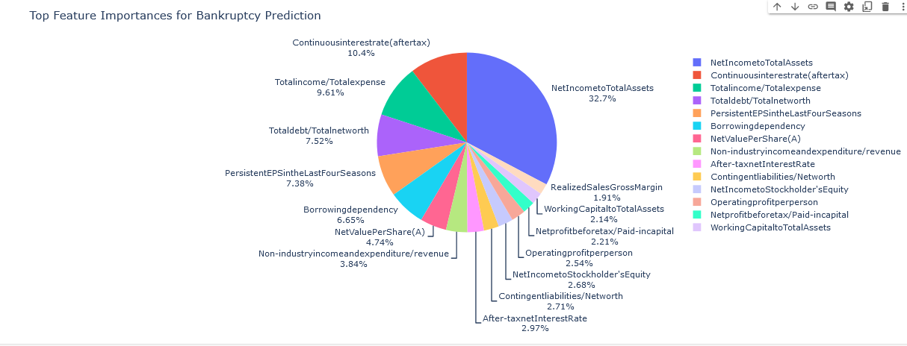
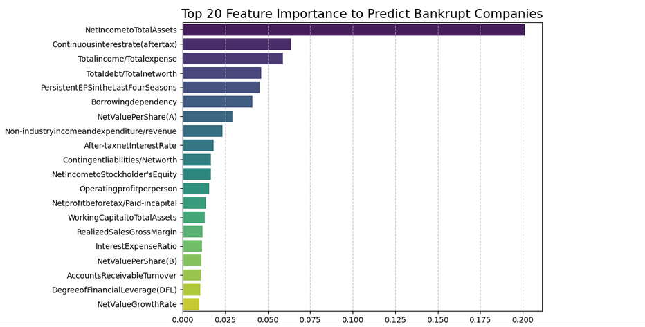

# bankruptcy_prediction

## Background

This project utilizes a dataset found on Kaggle, originally sourced from the Taiwan Economic Journal, covering the years 1999 to 2009. It comprises various financial attributes of companies, analyzed to assess the probability of bankruptcy.Bankruptcy definitions are aligned with the business regulations established by the Taiwan Stock Exchange. The objective is to utilize machine learning models to examine these financial attributes thoroughly and accurately predict the likelihood of company bankruptcies.

This is the main dataset:[(https://www.kaggle.com/datasets/fedesoriano/company-bankruptcy-prediction)]

## Objective

Employ different machine learning models to analyze various financial attributes from a dataset found on Kaggle, originally sourced from the Taiwan Economic Journal, with the goal of accurately predicting company bankruptcies.

 # Attribute Information
 
Column names and descriptions to make the data easier to understand (Y = Output feature, X = Input features)

Y - Bankrupt?: Class label

X1 - ROA(C) before interest and depreciation before interest: Return On Total Assets(C)

X2 - ROA(A) before interest and % after tax: Return On Total Assets(A)

X3 - ROA(B) before interest and depreciation after tax: Return On Total Assets(B)

X4 - Operating Gross Margin: Gross Profit/Net Sales

X5 - Realized Sales Gross Margin: Realized Gross Profit/Net Sales

X6 - Operating Profit Rate: Operating Income/Net Sales

X7 - Pre-tax net Interest Rate: Pre-Tax Income/Net Sales

X8 - After-tax net Interest Rate: Net Income/Net Sales

X9 - Non-industry income and expenditure/revenue: Net Non-operating Income Ratio

X10 - Continuous interest rate (after tax): Net Income-Exclude Disposal Gain or Loss/Net Sales

X11 - Operating Expense Rate: Operating Expenses/Net Sales

X12 - Research and development expense rate: (Research and Development Expenses)/Net Sales

X13 - Cash flow rate: Cash Flow from Operating/Current Liabilities

X14 - Interest-bearing debt interest rate: Interest-bearing Debt/Equity

X15 - Tax rate (A): Effective Tax Rate

X16 - Net Value Per Share (B): Book Value Per Share(B)

X17 - Net Value Per Share (A): Book Value Per Share(A)

X18 - Net Value Per Share (C): Book Value Per Share(C)

X19 - Persistent EPS in the Last Four Seasons: EPS-Net Income

X20 - Cash Flow Per Share

X21 - Revenue Per Share (Yuan ¥): Sales Per Share

X22 - Operating Profit Per Share (Yuan ¥): Operating Income Per Share

X23 - Per Share Net profit before tax (Yuan ¥): Pretax Income Per Share

X24 - Realized Sales Gross Profit Growth Rate

X25 - Operating Profit Growth Rate: Operating Income Growth

X26 - After-tax Net Profit Growth Rate: Net Income Growth

X27 - Regular Net Profit Growth Rate: Continuing Operating Income after Tax Growth

X28 - Continuous Net Profit Growth Rate: Net Income-Excluding Disposal Gain or Loss Growth

X29 - Total Asset Growth Rate: Total Asset Growth

X30 - Net Value Growth Rate: Total Equity Growth

X31 - Total Asset Return Growth Rate Ratio: Return on Total Asset Growth

X32 - Cash Reinvestment %: Cash Reinvestment Ratio

X33 - Current Ratio

X34 - Quick Ratio: Acid Test

X35 - Interest Expense Ratio: Interest Expenses/Total Revenue

X36 - Total debt/Total net worth: Total Liability/Equity Ratio

X37 - Debt ratio %: Liability/Total Assets

X38 - Net worth/Assets: Equity/Total Assets

X39 - Long-term fund suitability ratio (A): (Long-term Liability+Equity)/Fixed Assets

X40 - Borrowing dependency: Cost of Interest-bearing Debt

X41 - Contingent liabilities/Net worth: Contingent Liability/Equity

X42 - Operating profit/Paid-in capital: Operating Income/Capital

X43 - Net profit before tax/Paid-in capital: Pretax Income/Capital

X44 - Inventory and accounts receivable/Net value: (Inventory+Accounts Receivables)/Equity

X45 - Total Asset Turnover

X46 - Accounts Receivable Turnover

X47 - Average Collection Days: Days Receivable Outstanding

X48 - Inventory Turnover Rate (times)

X49 - Fixed Assets Turnover Frequency

X50 - Net Worth Turnover Rate (times): Equity Turnover

X51 - Revenue per person: Sales Per Employee

X52 - Operating profit per person: Operation Income Per Employee

X53 - Allocation rate per person: Fixed Assets Per Employee

X54 - Working Capital to Total Assets

X55 - Quick Assets/Total Assets

X56 - Current Assets/Total Assets

X57 - Cash/Total Assets

X58 - Quick Assets/Current Liability

X59 - Cash/Current Liability

X60 - Current Liability to Assets

X61 - Operating Funds to Liability

X62 - Inventory/Working Capital

X63 - Inventory/Current Liability

X64 - Current Liabilities/Liability

X65 - Working Capital/Equity

X66 - Current Liabilities/Equity

X67 - Long-term Liability to Current Assets

X68 - Retained Earnings to Total Assets

X69 - Total income/Total expense

X70 - Total expense/Assets

X71 - Current Asset Turnover Rate: Current Assets to Sales

X72 - Quick Asset Turnover Rate: Quick Assets to Sales

X73 - Working capitcal Turnover Rate: Working Capital to Sales

X74 - Cash Turnover Rate: Cash to Sales

X75 - Cash Flow to Sales

X76 - Fixed Assets to Assets

X77 - Current Liability to Liability

X78 - Current Liability to Equity

X79 - Equity to Long-term Liability

X80 - Cash Flow to Total Assets

X81 - Cash Flow to Liability

X82 - CFO to Assets

X83 - Cash Flow to Equity

X84 - Current Liability to Current Assets

X85 - Liability-Assets Flag: 1 if Total Liability exceeds Total Assets, 0 otherwise

X86 - Net Income to Total Assets

X87 - Total assets to GNP price

X88 - No-credit Interval

X89 - Gross Profit to Sales

X90 - Net Income to Stockholder's Equity

X91 - Liability to Equity

X92 - Degree of Financial Leverage (DFL)

X93 - Interest Coverage Ratio (Interest expense to EBIT)

X94 - Net Income Flag: 1 if Net Income is Negative for the last two years, 0 otherwise

X95 - Equity to Liability

## Project Work

### Different Machine Learning Models:

In this section, I explore the application of multiple machine learning models, each bringing a unique approach and perspective to the problem. My goal is to evaluate, compare, and understand the performance of each model, guiding me in selecting the most effective approach for predicting company bankruptcies. Through this comparative analysis, my aim is to derive meaningful insights and enhance the robustness and accuracy of my bankruptcy prediction capabilities.

## Logistic Regression:

At first, I used Logistic Regression and  Visualizing the class distribution of the target variable 'Bankrupt?' to understand the balance between the two classes.

**From the graph, it's evident that there is a significant class imbalance. The majority of the instances are non-bankrupt companies (class 0), and a much smaller proportion are bankrupt companies (class 1).**

and I got around **96% accuracy!**

Sometimes, higher accuracy might be misleading due to data imbalance.

### Confusion Matrix

**The output represents the confusion matrix for training data.**

Here's how to interpret it:

- The top-left element (4908) is the number of true negatives (TN), which indicates the number of non-bankrupt companies correctly predicted as non-bankrupt.

- The top-right element (41) is the number of false positives (FP), which indicates the number of non-bankrupt companies incorrectly predicted as bankrupt.

- The bottom-left element (161) is the number of false negatives (FN), which indicates the number of bankrupt companies incorrectly predicted as non-bankrupt.

- The bottom-right element (4) is the number of true positives (TP), which indicates the number of bankrupt companies correctly predicted as bankrupt.

And, **the output represents the confusion matrix for testing data.**

Here's how to interpret it:

- True Negatives (TN): The model correctly identified 1633 instances as Non-Bankrupt Companies.

- False Positives (FP): The model incorrectly classified 17 instances as Bankrupt Companies, which were actually Non-Bankrupt Companies.

- False Negatives (FN): The model failed to identify 55 instances as Bankrupt Companies, misclassifying them as Non-Bankrupt Companies.

- True Positives (TP): The model correctly identified Bankrupt Companies. 

### Classification Report

**For training data:**

**Analysis:**

Precision: For the non-bankrupt companies, when the model predicts they are non-bankrupt, it's right about 97% of the time. For bankrupt companies, when the model predicts they are bankrupt, it's right only about 9% of the time.

Recall: The model is very good at correctly identifying non-bankrupt companies, getting it right almost all the time (99%). However, it struggles to correctly identify bankrupt companies, getting it right only about 2% of the time.

F1-score: Overall, the model is quite good at correctly identifying non-bankrupt companies, achieving a balance between precision and recall (98%). However, it has difficulty identifying bankrupt companies, with a lower score (4%).

Accuracy: The overall accuracy of the model on the training data is 0.96, meaning that the model is correct in its predictions 96% of the time. However, since the classes are imbalanced, accuracy alone might not be the most reliable metric for model evaluation.

**For testing data:**

**Analysis:**

Precision: The model is very accurate at identifying non-bankrupt companies, with a precision of 97%. However, it is unable to correctly identify any bankrupt companies, as indicated by the precision of 0%.

Recall: The model has a high recall for non-bankrupt companies (99%), indicating it can accurately identify them. However, it has a recall of 0% for bankrupt companies, suggesting it is unable to identify any of them correctly.

F1-score: The F1-score, which balances precision and recall, is high for non-bankrupt companies (98%) but is 0 for bankrupt companies, highlighting the model's inability to correctly identify any bankrupt companies.

Accuracy: The accuracy is calculated as 0.96 or 96%. This means that the model correctly predicts the outcome for approximately 96% of the cases in the testing data.

These metrics suggest that while the model performs well in identifying non-bankrupt companies, it is unable to correctly identify any of the bankrupt companies. This implies that the model's performance is quite imbalanced, with a strong bias towards the majority class (non-bankrupt companies).

### My observation after training and testing report

Since my project's goal is to identify bankrupt companies, it's crucial to focus on metrics that specifically address the model's performance in correctly identifying the positive class (bankrupt companies).

Considering both the training and testing data analysis, I should primarily focus on improving the following key metrics:

Recall: Improving the model's ability to correctly identify bankrupt companies is essential. Given the low recall for bankrupt companies in both the training and testing data, increasing this metric is critical. Enhancing recall will ensure that the model captures more bankrupt companies, reducing the instances of false negatives.

F1-score: Since the F1-score considers both precision and recall, enhancing this metric for bankrupt companies is necessary. By improving the F1-score, I can achieve a better balance between precision and recall for bankrupt companies, indicating a more accurate model performance.

While accuracy provides an overall picture of the model's correctness, its reliability is limited when dealing with imbalanced datasets. Thus, focusing on improving recall and F1-score for bankrupt companies is crucial to enhancing the model's ability to correctly identify this specific class, aligning with my project goal.

### Recommendation

To improve the metrics related to correctly identifying bankrupt companies, such as recall and F1-score, I can consider using more sophisticated machine learning models that are adept at handling imbalanced datasets and capturing complex patterns. Two effective models that can help address these issues are the Random Forest Classifier and the Gradient Boosting Model.

## Random Forest Classifier

Next, I utilized the Random Forest algorithm. This method enhances model robustness and generalization by building and combining multiple decision trees, offering a more comprehensive and reliable prediction through its ensemble approach.

The classification report for testing data is shown below:

**Analysis:**

The precision for the bankrupt class is 0.47, suggesting that only 47% of the predicted bankrupt companies were actually bankrupt.

The recall for the bankrupt class is 0.16, implying that the model identified only 16% of the total bankrupt companies correctly.

The F1-score is 0.23 for the bankrupt class. These scores indicate that the model's performance in identifying bankrupt companies is relatively low.

The model achieved an accuracy of approximately 97%, indicating that it correctly classified 97% of the total instances in the dataset.

The results show that the model is performing well in predicting non-bankrupt companies, as indicated by high precision and recall values. However, it struggles with the bankrupt class, having low precision and recall scores. The model is more biased toward the non-bankrupt class, likely due to the imbalanced nature of the data.

## Gradient Boosting

After analyzing the results from the Random Forest model and identifying areas for improvement, I decided to explore the Gradient Boosting model next. The classification report generated thereafter provided detailed insights into the model's effectiveness in predicting company bankruptcies:

**Analysis:**

Accuracy: The model demonstrates an accuracy of 90% on the test data, indicating that it correctly predicts the class labels for approximately 90% of the samples.

Recall, F1-Score, and Precision: The recall for the "bankrupt" class is relatively high at 0.79, suggesting that the model correctly identifies 79% of the bankrupt companies. However, this high recall is balanced by a low precision of 0.23. This indicates that when the model predicts a company as bankrupt, it is correct only 23% of the time, resulting in a low F1-score of 0.36. These metrics collectively indicate that the model has a relatively high false positive rate for bankrupt companies.

There's a substantial class imbalance in the dataset. The "non_bankrupt" class has a significantly larger number of samples compared to the "bankrupt" class. This class imbalance can affect model performance, particularly in predicting the minority class.

#### I performed gradient boosting a second time to improve the model’s performance, particularly in predicting the minority class ("bankrupt"). By adjusting hyperparameters and implementing early stopping, you aimed to enhance the model’s ability to identify bankrupt companies more effectively, despite the presence of class imbalance. This iterative approach, with refined techniques, allowed for a more robust model that potentially offers improved recall and f1-score for the bankrupt class.

**The classification report for testing data is shown below:** 

Following the Gradient Boosting models, I then moved towards a visual exploration to understand the feature importance better. Utilizing pie and bar charts, I aimed to visually dissect and display the significance of different features in predicting bankruptcies. These visualizations were constructed to create clear and insightful charts that emphasize the influential features, allowing for a more intuitive grasp of which financial attributes hold the most weight in the bankruptcy prediction process. This visual approach complements the previous analyses, offering a more comprehensive perspective on the model’s decision-making factors.

   

**Analysis:**

The above pie and bar graphs highlight the significance of various financial indicators in predicting company bankruptcies. From the graph, it's evident that the ability of a company to generate income relative to its total assets, as indicated by "NetIncomeToTotalAssets", is the paramount predictor of bankruptcy risk. This underscores the idea that companies that are effective at turning their assets into profit have a lower bankruptcy likelihood. Other key metrics, such as "TotalDebt/TotalNetWorth", hint at the role of debt management in assessing risk; companies with high debt relative to their net worth may be more vulnerable to insolvency. Additionally, operational measures like "OperatingProfitPerPerson" highlight the importance of productivity and efficiency. When a company can generate more profit per employee, it often signifies a healthy operational structure. In essence, this graph suggests that for a company to stave off bankruptcy, it should prioritize efficient asset management, maintain a manageable debt level, and foster a productive operational environment.

In simple terms, companies that make good money, don't have too much debt and are efficient with their staff are in a safer position.

## Limitations:

**Class Imbalance:**

Despite efforts, class imbalance still seems to be affecting the performance of the models, particularly in identifying the bankrupt class.

**Model Bias:**

Models show a bias towards the majority class (non-bankrupt companies), which leads to a skew in the model's predictive capabilities in identifying bankrupt companies.

**Precision-Recall Trade-off:**

There seems to be a trade-off between precision and recall, particularly in the gradient-boosting model, where a higher recall comes at the cost of lower precision. In the Gradient Boosting model, there is a noticeable trade-off between precision and recall, which are two essential metrics in evaluating the model's performance. Specifically, when the model tries harder to identify as many actual bankrupt companies as possible (increasing recall), it tends to also incorrectly identify more non-bankrupt companies as bankrupt (decreasing precision).

## Advantages:

**Multiple Model Usage:**

Utilizing various models like Logistic Regression, Random Forest, Gradient Boosting, and XGBoost provides a diverse perspective and allows for the selection of the model that performs best.

**Detailed Analysis:**

Comprehensive analysis on each model's precision, recall, F1-score, and accuracy offers a well-rounded view of performance.

**Handling Class Imbalance:**

Efforts to address class imbalance and its acknowledgment in the analysis show a thoughtful approach to model improvement.

**Focus on Minority Class:**

Concentrating on the performance metrics of the minority class (bankrupt companies) ensures that the model is evaluated based on its ability to predict the most critical class accurately.

**Feature Importance Analysis:**

The models help in identifying and highlighting the most influential features, providing insight into the key factors contributing to bankruptcy risk.

**Early Warning:**

Despite not being perfect, the models can offer early warnings or signals of potential bankruptcies, providing valuable information for risk assessment and decision-making.

**Exploratory Analysis:**

Using various models facilitates a deeper exploratory analysis, helping to understand the data’s underlying patterns and trends better, and guiding further analysis and modeling.

**Continuous Improvement:**

These models are foundational and can be improved and refined over time with more data, advanced techniques, and continuous learning and adaptation, enhancing their predictive accuracy and reliability.

**Informed Decision-Making:**

Despite their current limitations, the models can be part of a broader analytical strategy, contributing valuable insights and information for more informed decision-making in predicting and mitigating bankruptcy risks.

 

